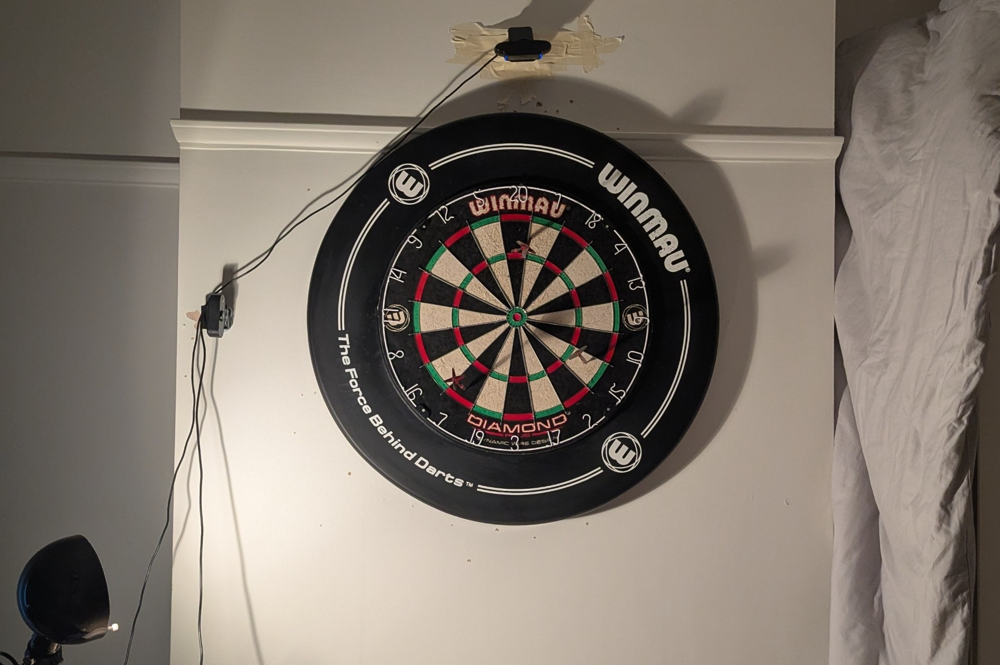
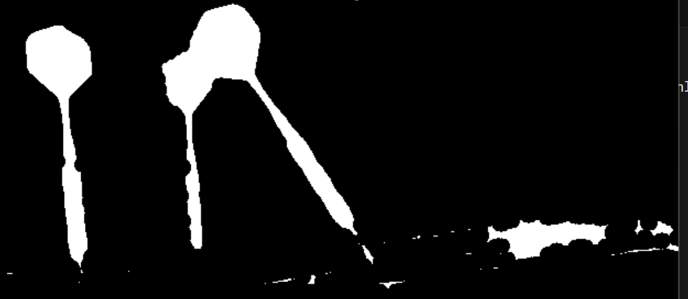
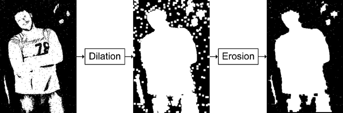

# Real-Time Dart Scoring & Stat Analysis System

A low-latency computer vision pipeline that tracks, maps, and scores physical dart impacts using two camera feeds. **(No Machine Learning involved)**.

## 1. Hardware setup

This solution relies on a two cam setup to capture x,y position on the board:
* **Top Camera:** Positioned above the board, pointing downward to capture horizontal (X-axis) displacement.
* **Side Camera:** Positioned to the left of the board, pointing parallel across the face to capture vertical (Y-axis) displacement.

*The hardware setup in my bedroom*

**Setting up the camera and lighting:**
* **Field of View:** Both cameras are mounted at a sufficient distance to capture the entire dartboard within their respective frames.
* **Lighting & Contrast:** Two auxiliary lighting sources (overhead and right-side under-lighting) were introduced to eliminate shadows. Additionally, a plain white backdrop (bed sheet) was placed behind the board to artificially increase contrast, which significantly aids the vision algorithm in isolating the darts.
* **Hardware Asymmetry:** The cameras used are of different models, which introduces varying levels of lens distortion that are corrected mathematically downstream.

## 2. The Computer Vision process

Cleanly extracting the dart tip is the most critical aspect of the pipeline. The project leverages OpenCV for high-speed image processing, relying on frame differencing (comparing a background reference frame to a frame containing a dart). 

*Above is my first image difference output, as you can see it is very noisy and the darts are not cleanly isolated I have iterated and improved on this*

To reduce noise and isolate the sub-pixel coordinates of the dart tip, several optimizations were implemented:

* **Gaussian Blurring:** Applied to both the reference and current frames before taking the absolute difference. This smooths minor lighting fluctuations and produces a cleaner delta image.
* **Region of Interest (ROI) Cropping:** Rather than processing the entire frame, the algorithm crops the processing matrix to isolate only the bottom 1/5th of the dart (the tip). This drastically reduces the size of the image matrices, minimizing latency and eliminating peripheral room noise.
* **Morphological Operations:** The pipeline utilizes custom dilation and erosion algorithms (closing). A mathematical kernel sweeps across the image array to expand the primary "blobs" (the dart) and erode away disconnected noise, ensuring the dart tip remains a connected part of the dart.

*The process of dilation then erosion is also called closing*

## 3. Mathematical Scoring & Statistical Analysis

Once the dart is isolated, the pipeline utilizes OpenCV's contour mapping to create a matrix object of the pixels, allowing the system to pinpoint the (X, Y) coordinates of the tip from both camera angles.

### Correcting Lens Distortion
Because the two cameras have distinct, non-linear lens distortions (acting similarly to a fish-eye effect), the raw coordinates of the same physical radius map to an ellipse rather than a true circle. To solve this, the pipeline applies a **Homography Matrix**. This applies a linear transformation to map the distorted coordinates onto a perfectly square grid where the exact center acts as the bullseye.

### Trigonometric Scoring
With the coordinates translated to a unified Cartesian plane, the system uses basic trigonometry to calculate:
* **Angle:** Determines the specific segment number (1-20) hit on the board.
* **Radius:** Determines the distance from the center (identifying singles, doubles, or triples). 
*(Note: Due to residual hardware distortion that is difficult to completely map, angle calculations currently yield higher accuracy than radial distance calculations).*

### Statistical Analytics
The system tracks historical throws and utilizes NumPy to calculate grouping consistency. By computing the center of mass (centroid) of a collection of throws, the pipeline calculates the mean radial deviation from that center. This outputs a quantifiable metric of player accuracy and grouping tightness over time.

### Current Limitations (Environment Specific)
Please note that this project is currently highly tailored to a specific physical setup. The Region of Interest (ROI) cropping, binary thresholding values for lighting, and the `DISTORTED_POINTS` used for the homography matrix are hardcoded. 

To use this on a new setup, you will need to manually measure and update these pixel coordinates in `main.py`. A dynamic calibration tool is planned for a future release.
   
